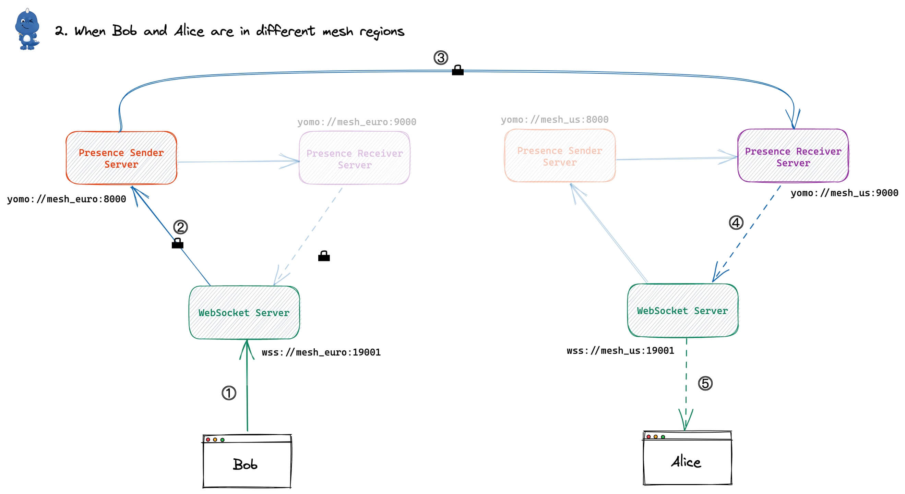

# YoMo Showcase: Implement an Virtual HQ Presence Service with Geo-Distributed Cloud 

This showcase demonstrates how to build a realtime [Presence](https://en.wikipedia.org/wiki/Presence_information) Sync Service of [Metaverse Workplace - Virtual Headquarters](https://techcrunch.com/2020/11/18/virtual-hqs-race-to-win-over-a-remote-work-fatigued-market/) with Geo-distributed Cloud Architecture by [YoMo](https://github.com/yomorun/yomo) and [Socket.IO](https://socket.io/).

Nowadays, users care about low-latency event transfermation, but backend services usually deployed to a dedicated cloud region, CDN is used for static resources, we need a CDN-like architecture but for upstream data and realtime computing. This showcase introduce a easy way to reach the goal.

## 🧑🏼‍🏫 Architecture Explanation

There are 3 parts in this Realtime Presence Sync Service: 

1. **Websocket Server**: accepts WebSocket connections from Web Browsers
2. **Presence Sender Service**: a YoMo Server responsible for dispatch presence to other nodes 
3. **Presence Receiver Service**: a YoMo Server responsible for recieving presence from Senders

By YoMo, we create an event stream from Bob to Alice, sync all presence from Bob to Alice. Assume Bob and Alice are all in Europe, they connect to same mesh node: 

<p align="center">

</p>

But When Bob is in Italy 🇮🇹 while Alice is in US 🇺🇸, the presence flow will be like below, it's done automatically by YoMo:



In this showcase, we separate presence sync flow to 2 parts, one is `Sender`, responsible for `Dispatching presence`, another is for `Receiving presence`. Every `Sender` will dispatching presence to every `Receivers`:

<p align="center">

</p>

YoMo care about security, presence in `Sender` and `Receiver` are encrypt by TLS v1.3 by default on [every datagram](https://datatracker.ietf.org/doc/html/draft-ietf-quic-tls-34):

<p align="center">

</p>

## 🔨 Dev on local

### 0. Prerequisites

[Install Go](https://golang.org/doc/install)

### 1. Install YoMo CLI

```bash
$ go install github.com/yomorun/cli/yomo@latest
```

See [YoMo CLI](https://github.com/yomorun/cli#installing) for details.

### 2. Start Next.js server

* **Next.js** version: [yomo-vhq-nextjs](https://github.com/yomorun/yomo-vhq-nextjs)

```bash
$ npm run dev

> yomo-vhq-nextjs@0.0.1 dev
> next dev

ready - started server on 0.0.0.0:3000, url: http://localhost:3000
info  - Loaded env from /Users/fanweixiao/tmp/yomo-vhq-nextjs/.env
info  - Using webpack 5. Reason: Enabled by default https://nextjs.org/docs/messages/webpack5
event - compiled successfully
event - build page: /next/dist/pages/_error
wait  - compiling...
event - compiled successfully
event - build page: /
wait  - compiling...
event - compiled successfully
[Index] isDEV= true
```

### 3. Start Presence-Reciever Server

```bash
$ yomo serve -v -c example/receiver-9000.yaml

Using config file: example/receiver-9000.yaml
ℹ️   Found 0 flows in zipper config
ℹ️   Found 1 sinks in zipper config
ℹ️   Sink 1: PresenceHandler
ℹ️   Running YoMo Serverless...
2021/07/13 16:44:28 ✅ Listening on localhost:9000
```

### 4. Start Presence-Sender Server

```bash
$ yomo serve -v -c example/sender-8000.yaml -m http://localhost:3000/dev.json

Using config file: example/sender-8000.yaml
ℹ️   Found 0 flows in zipper config
ℹ️   Found 0 sinks in zipper config
ℹ️   Running YoMo Serverless...
2021/07/13 16:45:10 ✅ Listening on localhost:8000
2021/07/13 16:45:10 Downloading Mesh config...
2021/07/13 16:45:10 ✅ Successfully downloaded the Mesh config. [{Receiver-A localhost 9000}]
```

### 5. Start Socket.io Server

```bash
$ MESH_ID=Local SENDER=localhost:8000 RECEIVER=localhost:9000 go run cmd/main.go
2021/07/13 16:48:37 MESH_ID: Local
2021/07/13 16:48:37 Starting socket.io server...
2021/07/13 16:48:37 Connecting to zipper localhost:8000...
2021/07/13 16:48:37 ✅ Connected to zipper localhost:8000.
[GIN-debug] [WARNING] Running in "debug" mode. Switch to "release" mode in production.
 - using env:	export GIN_MODE=release
 - using code:	gin.SetMode(gin.ReleaseMode)

[GIN-debug] GET    /socket.io/*any           --> github.com/gin-gonic/gin.WrapH.func1 (2 handlers)
------------Receiver init------------ host=localhost, port=9000
2021/07/13 16:48:37 Connecting to zipper localhost:9000...
[GIN-debug] POST   /socket.io/*any           --> github.com/gin-gonic/gin.WrapH.func1 (2 handlers)
[GIN-debug] Listening and serving HTTP on 0.0.0.0:19001
2021/07/13 16:48:37 ✅ Connected to zipper localhost:9000.
```

### 6. Open browser

http://localhost:3000/
